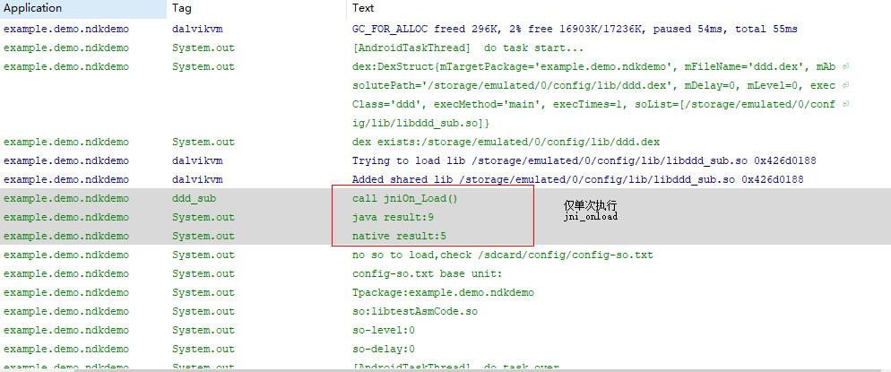

> ---
> # android系统实时动态加载指定的.dex .so
> ---
- 实现方式：
---
> 修改ActivityThread.java，创建线程实现循环检测/sdcard/config/目录下的config-dex.txt 和 config-so.txt文档，读取ControlFlag.txt中的内容，如果为on,并且为新修改过的则，加载config-dex.txt中的dex和config-so.txt中的so文件。
>>  /sdcard/config/目录下执行命令
>>  `echo "on">ControlFlag.txt`

---
- 实现基础
---
> * System.load(String path);
>>系统函数加载so,path为绝对路径
---
> * DexClassLoader dexloader=new DexClassLoader(String dexpath,String cachepath,String libpath,ClassLoader loader);
>>* dexpath :  要求绝对路径(可加载.dex;.jar;...)
>>* cachepath : 为/data/data/**package**/
>>* libpath : 可为null
>>* loader :getSystemLoader()
---
- 修改源码
---
>*  Loadcation: framework/base/core/java/android/app/ActivityThread.java
>>  * `handleBindApplication()``
>>  * 添加代码 `new AndroidTaskThread(instrContext).run();`
>>---
>>>---
>>>
>>>___
---
- Usage
---

```
作为AndroidTaskThread的控制执行文件
只读取第一行内容  on 执行 off 不执行
每次修改ControlFlag.txt文件,文件修改时间会变话,当前文件时间不等于前次执行时间，执行一次任务
如果内容为on，则执行一次config-dex.txt config-so.txt文件中的配置

```
----
---
> * 参数：dex-run-times dex-run-times:10000
>> 【实际意义不大】

```
dexClassLoader加载.dex文件,仅单次执行，dex-run-times:1(<100)
dexClassLoader加载.dex文件,常驻内存，dex-run-times:10000（>100）

```
----
- Result
---

>


----
